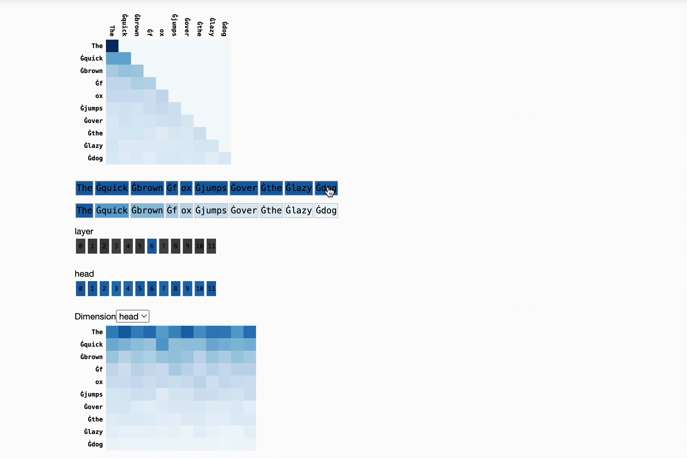

# Readme

Inspectus is a versatile visualization tool for large language models.
It runs smoothly in Jupyter notebooks via an easy-to-use Python API. Inspectus provides multiple views, offering diverse insights into language model behaviors.

## Preview



## Components

### Attention Matrix
[todo]

### Token Heatmap
[todo]

### Dimension Heatmap 
[todo]

### Token Dimension Heatmap
[todo]

### Line Grid
[todo]

## Getting Started

### Installation

```bash
pip install inspectus
```

### Usage

Import the library
```python
from inspectus import attention
```

Simple usage
```python
# atttns: A list of attention maps for each layer
# tokens: A list of tokens
attention(attns, tokens)
```

For different source and target tokens
```python
# source_tokens: A list of source tokens
# target_tokens: A list of target tokens
attention(attns, source_tokens, target_tokens)
```

Select which views to display
```python
# views: A list of views to display
# Possible values: 'attention_matrix', 'token_heatmap', 'dimension_heatmap', 'token_dimension_heatmap', 'line_grid'
attention(attns, tokens, chart_types=['attention_matrix', 'token_heatmap'])
```

For detailed API documentation, please refer to the [official documentation]().

## Tutorials

### Huggingface models

Following example uses a GPT2 Model from huggingface.

```python
# Import necessary libraries
from transformers import AutoTokenizer, GPT2LMHeadModel, AutoConfig
import torch
from inspectus import attention

# Define the context length
context_length = 128

# Initialize the tokenizer with a pretrained model
tokenizer = AutoTokenizer.from_pretrained("huggingface-course/code-search-net-tokenizer")

# Configure the model with the necessary parameters
config = AutoConfig.from_pretrained(
    "gpt2",
    vocab_size=len(tokenizer),  # Set the vocabulary size to the length of the tokenizer
    n_ctx=context_length,  # Set the context length
    bos_token_id=tokenizer.bos_token_id,  # Set the beginning of sentence token id
    eos_token_id=tokenizer.eos_token_id,  # Set the end of sentence token id
)

# Initialize the model with the defined configuration
model = GPT2LMHeadModel(config)

# Tokenize the input text
tokenized = tokenizer(
    'The quick brown fox jumps over the lazy dog',
    return_tensors='pt',  # Return PyTorch tensors
)

# Extract the input ids from the tokenized text
input_ids = tokenized['input_ids']

# Convert the token ids to tokens
tokens = [tokenizer.convert_ids_to_tokens(t.item()) for t in input_ids[0]]

# Disable gradient calculation as we're not training the model, just running inference
with torch.no_grad():
    # Run the model and get the output attentions
    res = model(input_ids=input_ids.to(model.device), output_attentions=True)

# Visualize the attention maps using the Inspectus library
attention(res['attentions'], tokens)
```

Check out the notebook here: [Inspectus Tutorial]()


### Custom Defined Attentions

```python
# Import the necessary libraries
import numpy as np
from inspectus import attention

# Define a 3D array representing attention values between source and destination tokens
# The outermost list represents different layers in the model
# Next dimension represents different heads in that layer
# Each head contains a 2D array representing the attention values for each head
arr = [
    [
        [[0.1, 0.7, 0.2],
         [0.2, 0.7, 0.1],
         [0.1, 0.7, 0.2],
        ]
    ]
]

# Convert the list to a numpy array
arr = np.array(arr)

# Visualize the attention values using the Inspectus library
# The first argument is the attention values
# The second argument is the list of source tokens
# The third argument is the list of destination tokens
attention(arr, ['a', 'b', 'c'], ['d', 'e', 'f'])
```

Check out the notebook here: [Inspectus Tutorial]()


# Setting up for Development

Clone the repository and install the python package

```bash
git clone git@github.com:labmlai/inspectus.git
cd python
pip install -e .
```

User interface uses [Weya](https://github.com/vpj/weya) for rendering the components.

Clone the Weya Repository and create symbolic link in the  `ui/lib/` directory

```bash
git clone git@github.com:vpj/weya.git
# From the ui/lib/ directory of the project
ln -s [weya cloned directory]/weya
```

Install the dependencies for the UI

```bash
cd ui
npm install
```

Build the UI

```bash
npm run build
npm run watch #  To watch for changes
```

Compiled JS and CSS files are in the `ui/build/` directory. 

Python package looks for these files in `static` directory of the `inspectus` package directory. (`python/inspectus`). If not found, it will use the files from the `ui/build/` directory.
